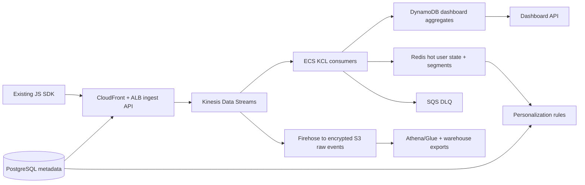

# Engineer 004: Real-Time Analytics Pipeline

## Position

I would rebuild around a durable event log with downstream serving stores, not around the dashboard database. The design preserves the existing JavaScript SDK contract, runs on AWS, supports [Observed from brief] 500+ tenants, and targets [Observed from brief] sub-5-second freshness for predefined dashboards and personalization triggers.

Artifacts:

- `infra/terraform/`: validated Terraform for the AWS ingestion core.
- `artifact/architecture.mmd`: standalone Mermaid diagram.
- `artifact/capacity_model.js`: executable shard/cost model.
- `artifact/validation_plan.md`: rollout release gates.
- `artifact/operational_runbook.md`: incidents, rollback, deletion.
- `prototype/`: local contract tests for dedupe, segment state, and reconciliation.

## 1. Architecture and Technology Choices



- **CloudFront + ALB + stateless ingest API** preserves the SDK endpoint. It authenticates tenants, normalizes schema, stamps `received_at`, computes an idempotency key if missing, and returns success only after Kinesis accepts the event.
- **Kinesis Data Streams, provisioned mode** is the durable log: replayable, ordered within partition keys, measurable lag, and lower MVP operational burden than introducing Kafka/MSK for [Observed from brief] 2 dedicated senior engineers.
- **ECS consumers using KCL 3.x enhanced fan-out** receive dedicated read throughput, batch-process events, dedupe by `event_id`, update hot state/aggregates, and route poison records to SQS DLQ. This prevents the sub-5-second path from contending with Firehose reads. I prefer long-running consumers over Lambda-only processing for replay and predictable cost.
- **Firehose to S3** stores immutable raw events partitioned by [Assumed] 32 `tenant_bucket` values plus date/hour, then compaction/export jobs repartition by tenant. Direct `tenant_id` dynamic partitioning is unsafe here: [Benchmarked] Firehose defaults to 500 active partitions and sends overflow to an error prefix. Separate export workers generate manifests and deliver through customer-specific Snowflake/BigQuery credentials. S3 is not the sub-5-second path.
- **Redis** stores recent behavior and segment membership such as "viewed pricing 3x." **DynamoDB** stores dashboard aggregates, a TTL dedupe ledger, and the deletion ledger. **PostgreSQL** stores metadata, schemas, export jobs, and rule definitions, not raw clickstream.

Event envelope:

```json
{
  "event_id": "tenant_id:source_id:sequence_or_hash",
  "tenant_id": "t_123",
  "subject_key": "pseudonymous_subject_abc",
  "session_id": "s_789",
  "event_type": "page_view",
  "event_time": "client timestamp",
  "received_at": "server timestamp",
  "schema_version": 1,
  "tenant_bucket": "hash(tenant_id) mod 32",
  "properties": {}
}
```

Partition by `tenant_id + stable visitor key`, with deterministic visitor-based salting for heavy tenants. This preserves visitor-local ordering without putting a tenant on one hot partition. Identity stitching is append-only: store anonymous-to-user links with effective timestamps and resolve identity in derived views; never rewrite raw events. Raw events use pseudonymous subject keys and an allowlisted property schema so direct PII does not become a lake cleanup problem.

Idempotency has a legacy-SDK edge case: if the existing SDK does not send a stable retry token, hashing fields can collapse legitimate identical clicks while server UUIDs cannot dedupe retries. I would inspect the current payload first; if no stable token exists, add server-side observability and accept best-effort dedupe until a backward-compatible SDK field is rolled out.

## 2. Scale, Reliability, and Migration

### Capacity

- [Observed from brief] 50M events/day; [Estimated] 579 events/sec average.
- [Observed from brief] 10x spike; [Assumed] 2 KB normalized events; [Estimated] 5,787 events/sec and 11.3 MB/sec peak.
- [Benchmarked] AWS Kinesis provisioned shards accept 1 MB/sec or 1,000 writes/sec per shard.
- [Estimated] 12 shards handle peak byte rate; provision 24 for 2x headroom.

`artifact/capacity_model.js` calculates a [Estimated] $1,384.25/month modeled floor for provisioned Kinesis, [Assumed] 72-hour retention, [Assumed] 1 enhanced-fan-out consumer, Firehose ingest/dynamic partitioning, and the hot S3 Standard tier before Firehose JQ-hours/S3 objects, S3 requests/cold tiers, ECS, Redis, DynamoDB request volume, NAT, logs, KMS keys/requests, and Athena. This leaves room under the [Observed from brief] $50K/month ceiling. `infra/terraform/` defines the stream, registered EFO consumer, rotated customer-managed KMS key, encrypted/versioned/lifecycle-managed S3 bucket, Firehose, SQS DLQ, DynamoDB tables, IAM policies, and CloudWatch alarms. It passed `terraform validate`; it was not deployed to AWS.

Provisioned mode is the MVP choice because baseline traffic is forecastable. I would re-price On-demand Advantage if aggregate ingest stays above [Benchmarked] 10 MB/sec, traffic becomes uneven, or more than [Benchmarked] 2 fan-out consumers are needed.

### Reliability and Accuracy

"Zero data loss" must be scoped honestly: no accepted server-side event is silently lost. Browser/network/ad-blocking loss is outside the server guarantee.

- Acknowledge only after durable Kinesis write. For batched `PutRecords`, inspect `FailedRecordCount` and retry only failed entries with jitter; HTTP 200 does not mean every record succeeded.
- Use at-least-once delivery. For dashboard aggregates, transact a conditional put into the DynamoDB processed-event TTL ledger plus the counter update; duplicates fail the condition. For Redis hot state, use an atomic Lua dedupe/update script and treat Redis as replayable derived state.
- Track accepted, processed, duplicate, late, invalid, DLQ, and aggregate-write counts by tenant/event type/window.
- Alert on [Observed from brief] freshness above 5 seconds, EFO `SubscribeToShardEvent.MillisBehindLatest`, write throttles, DLQ spikes, and accepted-vs-processed drift.
- Reconcile accepted counts vs consumer checkpoints, S3 raw counts after Firehose delay, and old-vs-new aggregates during shadow mode.
- Sample dashboard rows and trace them back to raw event ids.

### Migration and Rollback

- [Assumed] **Month 1:** deploy behind the existing endpoint, dual-write old/new paths, land raw S3 events, and build reconciliation metrics. Dashboard reads remain old-path.
- [Assumed] **Month 2:** shadow process internal/pilot tenants. Compare aggregates by tenant, event type, and time bucket; fix schema, identity, and late-event cases.
- [Observed from brief] **Month 3 MVP:** route [Estimated] 5%-10% of tenant dashboard reads to the new API while dual-write remains active. Rollback is a per-tenant feature flag switching reads back.
- [Observed from brief] **Months 4-6:** migrate remaining tenants, add exports, automate deletion workflows, then retire the old pipeline after a reconciliation window.

Release gate: no unexplained tenant aggregate drift above [Assumed] 0.1% for [Assumed] 7 consecutive days before widening rollout. See `artifact/validation_plan.md`.

## 3. Trade-offs and Risks

This optimizes for a credible 3-month MVP, replayability, and operational clarity. It sacrifices arbitrary real-time SQL analytics and strict exactly-once semantics. If broad interactive fresh analytics becomes necessary, add ClickHouse/Pinot downstream after the durable log is stable.

Risks:

- **Hot tenant partitions:** detect shard lag; mitigate with tenant-specific salted keys.
- **Bad client clocks:** use `received_at` for operational windows, retain `event_time` for analytics.
- **Export jobs hurting freshness:** isolate workers; read exports from S3, not hot stores.
- **Schema drift:** version schemas; send unknown shapes to DLQ; review top failures.
- **KCL metadata lifecycle:** KCL 3.x creates DynamoDB lease, worker-metrics, and coordinator-state tables; name, monitor, and delete them when decommissioning the application.
- **Deletion ambiguity:** purge serving stores and revoke subject-key resolution; legal/security must approve retention and the exceptional raw-log rewrite policy if prohibited PII reaches S3.

With more time/budget, I would run an AWS sandbox load test, export a region-specific AWS Pricing Calculator estimate, add OpenTelemetry traces from ingest to aggregate write, and evaluate ClickHouse/Pinot only if product query requirements justify it.

## Evidence Log

| Claim | Source label | Proof tier |
|---|---:|---:|
| Brief constraints and required scale | Observed from brief | 3 |
| Shard count and core cost | Estimated by executable model | 2 |
| Kinesis limits/pricing | Benchmarked from AWS docs/pricing | 1 |
| AWS core IaC passes `terraform validate` | Observed from local validation | 2 |
| Dedupe/segment/reconciliation contract passes local tests | Observed from local test run | 2 |

Sources: [Kinesis pricing](https://aws.amazon.com/kinesis/data-streams/pricing/), [Kinesis limits](https://docs.aws.amazon.com/streams/latest/dev/service-sizes-and-limits.html), [enhanced fan-out](https://docs.aws.amazon.com/streams/latest/dev/enhanced-consumers.html), [CloudWatch metrics](https://docs.aws.amazon.com/streams/latest/dev/monitoring-with-cloudwatch.html), [`PutRecords`](https://docs.aws.amazon.com/kinesis/latest/APIReference/API_PutRecords.html), [KCL metadata tables](https://docs.aws.amazon.com/streams/latest/dev/kcl-dynamoDB.html), [DynamoDB transactions](https://docs.aws.amazon.com/amazondynamodb/latest/developerguide/transaction-apis.html), [Firehose buffering](https://docs.aws.amazon.com/firehose/latest/dev/buffering.html), [Firehose metrics](https://docs.aws.amazon.com/firehose/latest/dev/monitoring-with-cloudwatch-metrics.html), [Firehose pricing](https://aws.amazon.com/firehose/pricing/), [S3 pricing](https://aws.amazon.com/s3/pricing/).

## What Breaks It, What Stays Human, AI Disclosure

This plan breaks if the SDK cannot retry retryable errors, a tenant concentrates traffic on too few visitor keys, legal requires faster raw-log physical deletion than S3 partition rewrites support, or the MVP secretly requires arbitrary fresh SQL.

Humans approve retention policy, deletion exceptions, customer-facing SLOs, partition changes, and rollout widening. AI can draft runbooks, summarize drift, and generate test data; it should not approve compliance posture or unexplained data loss.

I used AI to structure the response, draft first-pass artifacts, and challenge trade-offs. I checked the brief/rubric, selected the architecture, labeled assumptions, ran Node artifacts/tests, installed Terraform, and validated the IaC. Known limitation: Terraform was validated statically, not applied in an AWS account.
